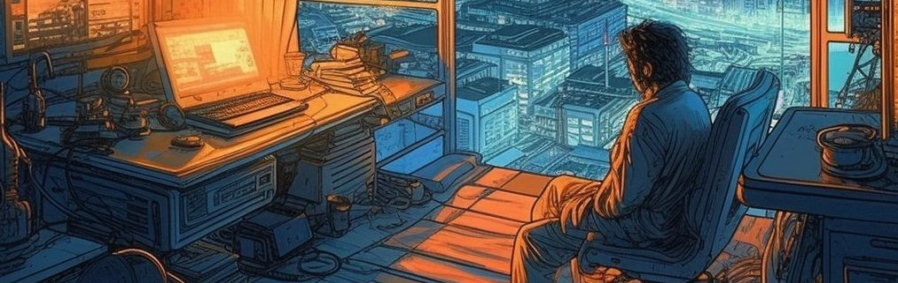

    

I'm [Ishan](https://ishanshah.me). I'll mainly write notes here about machine learning, distributed systems, and [[Idea List|things I'm building]]. You can browse on the left, explore the graph on the right, or search the whole site with `⌘+K`.

[[notes|All notes]] are in one of three states:
- [[seed|Seed]]: brief ideas
- [[sapling|Sapling]]: fully-formed thoughts
- [[evergreen|Evergreen]]: permanent, constantly growing

I'm currently working through the [[MLIB Practice Problems|Machine Learning Interviews Book]]. If you're bored, start by checking out [[Library]], [[ML Links]], [[SSH Scripts]]  or any of my other [[evergreen|Evergreen]] pages. Enjoy!